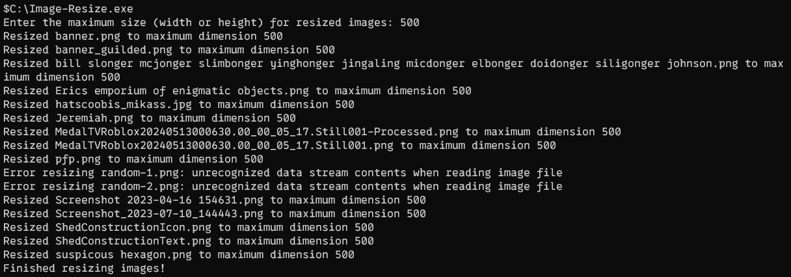

# python-Image-resizer
Resizes a folder of images base on a max size

# Usage:

1. Open a folder in command prompt
2. Run the file in the command prompt
Example :

#For the best experience, please add the program to path
